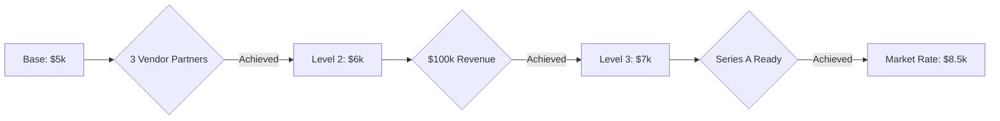

# Compensation Structure Discussion
## PeptideTracker Founder Alignment Meeting

---

## Slide 1: Agenda
### Building a Fair & Sustainable Compensation Model

1. **Current State Assessment** (5 min)
2. **Proposed Structure** (10 min)
3. **Milestone Framework** (10 min)
4. **Comparable Analysis** (5 min)
5. **Discussion & Alignment** (20 min)

---

## Slide 2: Where We Are Today
### Contribution Assessment

```
WORK COMPLETED TO DATE
━━━━━━━━━━━━━━━━━━━━━━━━━━━━━━━━━━━━━━━━━━━━━━━━━
Technical Development    ████████████████████░ 95%
Business Development     █░░░░░░░░░░░░░░░░░░░░  5%
Marketing/Growth         ░░░░░░░░░░░░░░░░░░░░░  0%
```

### Tangible Deliverables
✅ **Platform Built**: Full MVP live at peptidetracker.com
✅ **Investment Ready**: Complete pitch deck & business plan  
✅ **Technical Foundation**: Scalable architecture, minimal tech debt
✅ **Market Validation**: Initial user traction demonstrated

---

## Slide 3: The Challenge
### Balancing Fairness with Sustainability

**Key Tensions:**
- Past contribution vs. future value creation
- Market-rate compensation vs. runway preservation  
- Equal draws vs. merit-based structure
- Immediate needs vs. long-term incentives

**Our North Star:**
> "Compensation should reflect value creation - past, present, and future"

---

## Slide 4: Proposed Base Structure
### Monthly Compensation Tiers

| Role | Month 1-3 | Month 4-6 | Month 7-12 | Market Rate |
|------|-----------|-----------|------------|-------------|
| **CEO/CTO** | $8,000 | $8,000 | $8,000 | $10,000 |
| **COO** | $5,000 | $6,000* | $7,000* | $8,500 |
| **Marketing** | $0 | $4,000 | $4,000 | $6,000 |

*Contingent on milestone achievement

**Total Monthly Burn:**
- Months 1-3: $13,000
- Months 4-6: $18,000  
- Months 7-12: $19,000

---

## Slide 5: Milestone Gates
### Performance-Based Increases



### COO Specific Milestones

**Gate 1 → $6,000/month**
- [ ] 3+ vendor partnerships signed
- [ ] Affiliate program launched
- [ ] Legal compliance framework established

**Gate 2 → $7,000/month**
- [ ] $100k partnership revenue achieved
- [ ] 15% conversion rate on affiliates
- [ ] Operating costs reduced 20%

**Gate 3 → Market Rate**
- [ ] Series A metrics achieved
- [ ] Break-even operations
- [ ] Strategic acquisition interest

---

## Slide 6: Why This Structure?
### Data-Driven Rationale

**Industry Benchmarks (Seed Stage SaaS)**
```
Position         Average    Our Proposal   Savings
━━━━━━━━━━━━━━━━━━━━━━━━━━━━━━━━━━━━━━━━━━━━━
Technical CEO    $110k      $96k          13%
Business COO     $90k       $60-84k       20%
Combined         $200k      $156-180k     22%
```

**Runway Impact**
- Equal draws ($8k each): 18 months runway
- Proposed structure: 24+ months runway
- Difference: 6 extra months to achieve milestones

---

## Slide 7: Equity Considerations
### Balancing Cash with Ownership

**Current Equity Split**: [To be discussed]

**Proposed Adjustments:**
1. **Accelerated Vesting** for technical founder (work already done)
2. **Performance Pool** (5%) for milestone achievements
3. **Refresh Grants** tied to Series A raise

**Value Creation Formula:**
```
Total Comp = Base Salary + Performance Bonus + Equity Value
```

At Series A ($30M valuation):
- 10% equity = $3M value
- 5% equity = $1.5M value
- Performance pool = $150k-750k

---

## Slide 8: Comparable Companies
### How Others Have Done It

**Successful SaaS Startups (Seed → Series A)**

| Company | Tech Founder | Biz Founder | Outcome |
|---------|-------------|-------------|---------|
| Calendly | $65k | $45k | $3B valuation |
| Notion | $70k | $50k | $10B valuation |
| Airtable | $80k | $60k | $11B valuation |
| Canva | $75k | $75k* | $40B valuation |

*Equal only after product-market fit

**Key Learning**: Successful companies often start with differentiated comp, equalizing only after major milestones

---

## Slide 9: Risk Mitigation
### Protecting Against Downside Scenarios

**If Revenue Below Target:**
```
Step 1: Founders take 20% cut first
Step 2: Freeze non-critical hires  
Step 3: Increase equity component
Step 4: Seek bridge funding
```

**If Ahead of Target:**
```
✓ Accelerate to market rates
✓ Implement bonus pool
✓ Hire ahead of plan
✓ Increase marketing spend
```

**Contractual Safeguards:**
- Quarterly review cycles
- Board oversight on increases
- Clawback provisions if milestones reversed
- Good leaver/bad leaver provisions

---

## Slide 10: Implementation Timeline
### Next 30 Days

**Week 1:**
- [ ] Align on base structure
- [ ] Define specific KPIs
- [ ] Draft legal agreements

**Week 2:**
- [ ] Board approval
- [ ] Set up payroll
- [ ] Document milestones

**Week 3:**
- [ ] Legal review
- [ ] Sign agreements
- [ ] Implement tracking

**Week 4:**
- [ ] First payroll run
- [ ] KPI dashboard live
- [ ] Monthly review scheduled

---

## Slide 11: The Conversation
### Key Discussion Points

**For CEO/CTO:**
1. Is $8k sustainable for you personally?
2. What milestones would make you comfortable with COO increases?
3. How do we handle equity adjustments?

**For COO:**
1. Are the milestones achievable and fair?
2. What support do you need to hit them?
3. Timeline expectations for each gate?

**For Both:**
1. How do we handle disagreements?
2. What happens if we need to pivot?
3. Exit strategy alignment?

---

## Slide 12: Decision Framework
### Making the Call

**Option A: Performance Structure**
- Pros: Extends runway, rewards results, fair to contributions
- Cons: Initial disparity, complexity, potential friction

**Option B: Equal Draws**
- Pros: Simple, equal, no friction
- Cons: Shorter runway, ignores contribution, market disconnect

**Option C: Hybrid Approach**
- Start performance-based
- Equalize at Series A
- Review quarterly

**Recommendation:** Option A with commitment to equalize at Series A

---

## Slide 13: Commitments & Next Steps
### Mutual Agreements

**CEO/CTO Commits To:**
- Leading technical development
- Mentoring COO on product
- Transparent communication
- Supporting partnership efforts

**COO Commits To:**
- Aggressive partnership targets
- Revenue accountability
- Operational excellence
- Supporting technical priorities

**Both Commit To:**
- Monthly reviews
- Transparent metrics
- Unified front with team
- Long-term vision alignment

---

## Slide 14: Summary
### The Path Forward

✅ **Fair Structure**: Reflects actual contributions
✅ **Growth Incentives**: Clear milestone progression  
✅ **Sustainable**: 24+ month runway
✅ **Market Aligned**: Comparable to successful startups
✅ **Flexible**: Quarterly review cycles

**The Ask:**
1. Agreement on base structure
2. Commitment to milestones
3. Sign-off on implementation timeline
4. United front to team and investors

---

## Slide 15: Q&A
### Open Discussion

**"The goal isn't equal compensation,
it's equal opportunity to earn based on value created"**

### Topics for Discussion:
- Concerns about the structure?
- Alternative proposals?
- Implementation challenges?
- Communication to team?
- Investor messaging?

---

## Appendix: Financial Impact Analysis

### Scenario Modeling

**Conservative Case (50% revenue target)**
- Runway: 20 months
- Break-even: Month 14
- Series A: Required by Month 18

**Base Case (100% revenue target)**
- Runway: 24 months  
- Break-even: Month 9
- Series A: Optional, strategic

**Optimistic Case (150% revenue target)**
- Runway: 30+ months
- Break-even: Month 6
- Series A: On our terms

---